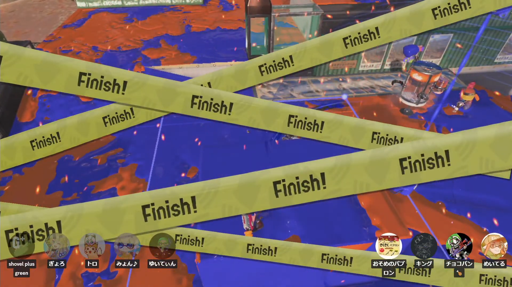
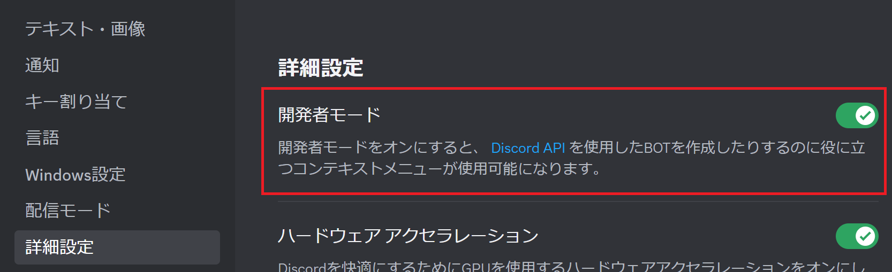
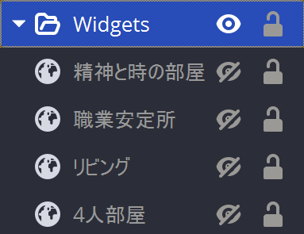

# 目次

<!-- START doctoc generated TOC please keep comment here to allow auto update -->
<!-- DON'T EDIT THIS SECTION, INSTEAD RE-RUN doctoc TO UPDATE -->

- [サンプル](#%E3%82%B5%E3%83%B3%E3%83%97%E3%83%AB)
- [導入方法](#%E5%B0%8E%E5%85%A5%E6%96%B9%E6%B3%95)
- [よくある質問](#%E3%82%88%E3%81%8F%E3%81%82%E3%82%8B%E8%B3%AA%E5%95%8F)
  - [プラベの例みたいに右下に表示するには？](#%E3%83%97%E3%83%A9%E3%83%99%E3%81%AE%E4%BE%8B%E3%81%BF%E3%81%9F%E3%81%84%E3%81%AB%E5%8F%B3%E4%B8%8B%E3%81%AB%E8%A1%A8%E7%A4%BA%E3%81%99%E3%82%8B%E3%81%AB%E3%81%AF)
  - [通話に入る度に毎回サイト開いてURL作るのが面倒くさい！](#%E9%80%9A%E8%A9%B1%E3%81%AB%E5%85%A5%E3%82%8B%E5%BA%A6%E3%81%AB%E6%AF%8E%E5%9B%9E%E3%82%B5%E3%82%A4%E3%83%88%E9%96%8B%E3%81%84%E3%81%A6url%E4%BD%9C%E3%82%8B%E3%81%AE%E3%81%8C%E9%9D%A2%E5%80%92%E3%81%8F%E3%81%95%E3%81%84)
  - [使いたいチャンネルがいっぱいあって毎回URLを変えるのが面倒くさい！](#%E4%BD%BF%E3%81%84%E3%81%9F%E3%81%84%E3%83%81%E3%83%A3%E3%83%B3%E3%83%8D%E3%83%AB%E3%81%8C%E3%81%84%E3%81%A3%E3%81%B1%E3%81%84%E3%81%82%E3%81%A3%E3%81%A6%E6%AF%8E%E5%9B%9Eurl%E3%82%92%E5%A4%89%E3%81%88%E3%82%8B%E3%81%AE%E3%81%8C%E9%9D%A2%E5%80%92%E3%81%8F%E3%81%95%E3%81%84)

<!-- END doctoc generated TOC please keep comment here to allow auto update -->

# サンプル

<p>
  
  
</p>

# 導入方法
Discord Streamkit Overlayを以下のページに従って設定し、「**話している人を光らせるには？**」の章の**直前**まで進めてください。

https://vip-jikkyo.net/discord-streamkit

**注意: いくつか設定値がページの説明と違う部分があります。**

```
StreamKitの設定
- Text Size: 20px を推奨
ブラウザソースのサイズ (1080pでの配信の場合)
- 幅: 960
- 高さ: 1080
```

「**話している人を光らせるには？**」の章まで来たら、説明にあるカスタムCSSの部分に、このリポジトリの [style.css](https://github.com/meitel1014/discord-overlay-css/blob/master/style.css) を丸ごとコピーして貼り付けてください。

（右上の「Copy raw file」ボタンが便利）


以上の設定で、StreamKitで指定した通話チャンネルの参加者が配信に映るようになります。

# よくある質問
## プラベの例みたいに右下に表示するには？
カスタムCSSの3行目のコメント枠 `/* */`を消して
```
right: 0px;
```
としてください。

https://github.com/meitel1014/discord-overlay-css/blob/master/style.css#L3

この状態だと参加者のアイコンと名前が右下詰めで表示されます。

この状態でOBSのプレビュー画面から参加者一覧のブラウザソースを右側に持っていくと配信画面の右下に表示されるようになります。

## 通話に入る度に毎回サイト開いてURL作るのが面倒くさい！
オーバーレイのサイトで生成されるURLの最初は以下の構造になっています。
```
https://streamkit.discord.com/overlay/voice/[サーバーID]/[チャンネルID]
```

つまり、サーバーIDとチャンネルIDさえ分かれば毎回URLを生成しなくてもこの部分だけ書き換えれば使い回しができます。

このIDを取得してURLを更新する方法はこちら。

1. Discordの設定から、開発者モードをオンにする。 
2. OBSのStreamKitを設定したブラウザソースのプロパティを開く。
3. サーバー名の部分を右クリックして、「サーバーIDをコピー」をクリックする。
4. URLのサーバーID部分をダブルクリックするといい感じに選択できるので、コピーしてきたサーバーIDを貼り付ける。
5. 通話チャンネル名の部分を右クリックして、「チャンネルIDをコピー」をクリックする。
6. URLのチャンネルID部分をダブルクリックするといい感じに選択できるので、コピーしてきたチャンネルIDを貼り付ける。

<p style="text-align: center;">
  
  
</p>


## 使いたいチャンネルがいっぱいあって毎回URLを変えるのが面倒くさい！
使うチャンネルのURLを書いたソースをチャンネルごとに作っておきましょう。

ソースの右の目のアイコンをクリックすると表示/非表示を切り替えられます。

フォルダ機能を使えば一つにまとめることもできます。

例:


